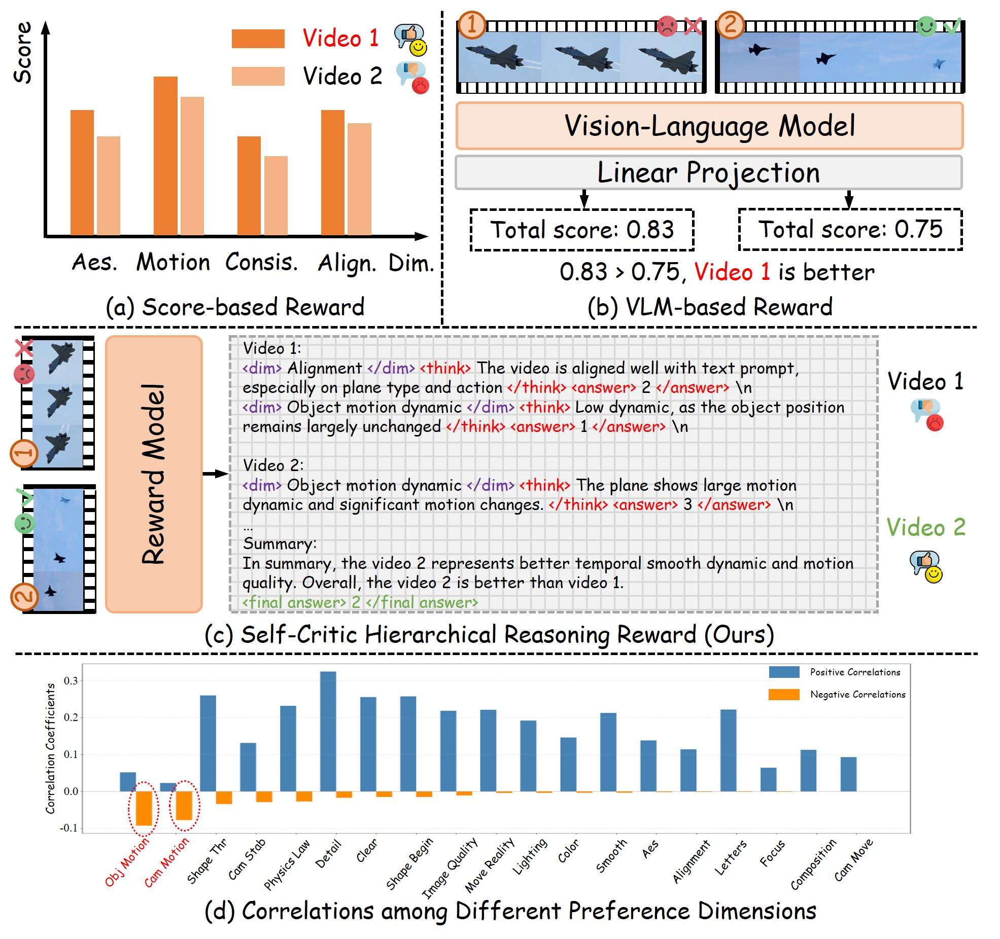
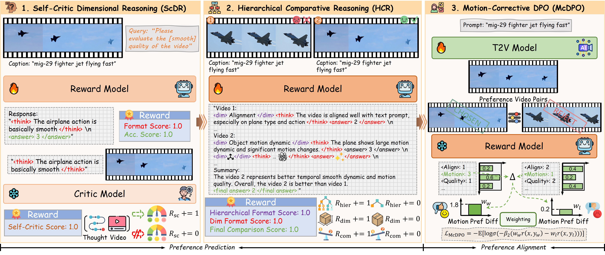
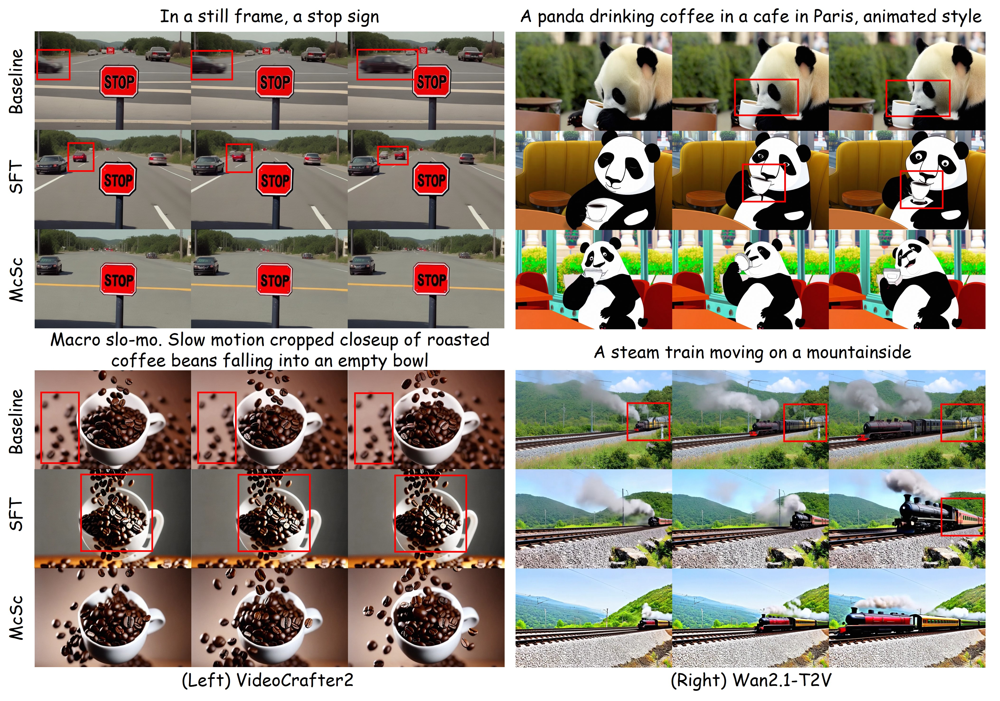

<div align="center">

# McSc: Motion-Corrective Preference Alignment for Video Generation with Self-Critic Hierarchical Reasoning

[Qiushi Yang](https://qiushiyang.github.io/), [Yingjie Chen](https://scholar.google.com/citations?hl=zh-CN&user=3fmmfg8AAAAJ), [Yuan Yao](https://scholar.google.com/citations?user=mpwXqNoAAAAJ&hl=zh-CN), [Yifang Men](https://menyifang.github.io/), [Huaizhuo Liu](https://www.researchgate.net/profile/Huaizhuo-Liu), [Miaomiao Cui](https://scholar.google.com/citations?user=C-7UhS9dBroC&hl=zh-CN)

[Tongyi Lab, Alibaba](https://tongyi.aliyun.com/welcome) 
</div>

<a href="https://github.com/QiushiYang/McSc"></a>
<a href='https://github.com/QiushiYang/McSc'></a>


This repository is the official implementation of McSc: Motion-Corrective Preference Alignment for Video Generation with Self-Critic Hierarchical Reasoning

## :fire: Abstract

Text-to-video (T2V) generation has achieved remarkable progress in producing high-quality videos aligned with textual prompts. However, aligning synthesized videos with nuanced human preference remains challenging due to the subjective and multifaceted nature of human judgment.
Existing video preference alignment methods rely on costly human annotations or utilize proxy metrics to predict preference, which lacks the understanding of human preference logic. 
Moreover, they usually directly align T2V models with the overall preference distribution, ignoring potential conflict dimensions like motion dynamics and visual quality, which may bias models towards low-motion content. 
To address these issues, we present Motion-corrective alignment with Self-critic hierarchical Reasoning (McSc), a three-stage reinforcement learning framework for robust preference modeling and alignment. Firstly, Self-critic Dimensional Reasoning (ScDR) trains a generative reward model (RM) to decompose preferences into per-dimension assessments, using self-critic reasoning chains for reliable learning. 
Secondly, to achieve holistic video comparison, we introduce Hierarchical Comparative Reasoning (HCR) for structural multi-dimensional reasoning with hierarchical reward supervision. 
Finally, using RM-preferred videos, we propose Motion-corrective Direct Preference Optimization (McDPO) to optimize T2V models, while dynamically re-weighting alignment objective to mitigate bias towards low-motion content. Experiments show that McSc achieves superior performance in human preference alignment and generates videos with high-motion dynamic.


## 💡 Motivation

<p align="center">

</p>

This work aims to address the challenge of aligning text-to-video generation models with human preferences. Traditional preference alignment methods rely heavily on large-scale human-annotated preference data, which is both time-consuming and labor-intensive. To mitigate this, recent studies have proposed a two-stage framework: preference prediction followed by preference alignment. In this framework, a preference model is first used to automatically estimate human preferences for generated videos, and the resulting pseudo-preferences are then leveraged to optimize the generative model. Building upon this paradigm, our work introduces a novel preference prediction approach, ScHR, comprising two sequential training stages, ScDR and HCR, followed by a new strategy for preference alignment.

Specifically, to improve both preference prediction and alignment, we draw inspiration from the way humans naturally evaluate video quality. Humans typically decompose their assessment into multiple dimensions (e.g., motion dynamics, visual quality, temporal consistency), evaluate each dimension independently, and then integrate these multi-dimensional judgments into an overall preference score. We design our training process to mimic this cognitive mechanism: the model first learns the reasoning behind human judgments along individual dimensions (ScDR), and then acquires the ability to synthesize cross-dimensional evaluations into a holistic preference (HCR).

In the course of our analysis, we uncover an unexpected yet critical phenomenon: some of dimensions involved in human preference annotations exhibit significant contradictions and negative correlations. Notably, we observe a strong negative correlation between motion dynamics and static visual quality dimensions—videos with lower motion dynamics tend to score higher on other static quality metrics, leading human annotators to rate them more favorably overall. However, using such preferences for model optimization biases the generator toward producing videos with reduced motion dynamics, ultimately compromising motion richness and diversity. To address this issue, we propose McDPO, a novel alignment strategy that explicitly mitigates this trade-off and encourages the generation of videos with enhanced motion dynamics.


## 📚 Method

<p align="center">

</p>

We propose McSc for video generation, integrating human preference reasoning and preference alignment to synthesis videos with estimated preference. 
McSc contains three key steps: (1) ScDR trains a generative reward model with a self-critic strategy towards single-dimension preference reasoning, (2) HCR exploits holistic video assessment with structured reward mechanisms, and (3) McDPO optimizes the video generation model to synthesize diverse videos align with true human preference by reducing evaluation dimension bias.


## 🎖️ Results

<p align="center">

</p>

Visualization comparison of generated videos by the baselines and the proposed method. Our McSc generate videos with larger motion dynamic and stronger semantic alignment.


## 📖 Acknowledgment

McSc is built on top of [Open-R1-Video](https://github.com/Wang-Xiaodong1899/Open-R1-Video) and [VideoDPO](https://github.com/facebookresearch/sam2?tab=readme-ov-file) and [Wan2.1](https://github.com/Wan-Video/Wan2.1). 

The evaluation code is modifed from [VBench](https://github.com/Vchitect/VBench).


## 🎓 Citation

Please consider citing our paper if you found our work interesting and useful.
```
@article{arxiv_McSc_coming_soon,
  title={McSc: Motion-Corrective Preference Alignment for Video Generation with Self-Critic Hierarchical Reasoning},
  author={Yang, Qiushi and Yingjie Chen and Yuan Yao and Yifang Men and Huaizhuo Liu and Miaomiao Cui},
  journal={To be preprint},
  year={2025}
}
```
